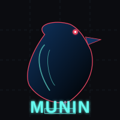

<div align="center">
  
  <h1>Munin</h1>
  <h3>The AI Memory that knows when to FORGET.</h3>

  [](https://www.python.org/downloads/)
  [](https://opensource.org/licenses/MIT)
  []()
  []()
</div>

---

## 🧠 The Problem: Context Bloat & Hallucinations

Standard RAG (Retrieval-Augmented Generation) systems blindly retrieve data, flooding the LLM with noise. This leads to **high token costs**, **slow responses**, and **hallucinations** caused by conflicting or outdated information.

**Munin solves this by managing memory like a human: remembering what matters and forgetting what doesn't.**

| Feature | ❌ Standard RAG | ✅ Munin |
| :--- | :--- | :--- |
| **Retrieval Strategy** | Retrieve Top-K chunks blindly | **Smart Pruning** & Semantic Reranking |
| **Conflict Handling** | Feeds conflicting data to LLM | **Hallucination Guard** detects conflicts |
| **Data Lifecycle** | Data is permanent (append-only) | **Active Forgetting** (TTL & Topic-based) |
| **Cost Efficiency** | High (irrelevant tokens included) | **Optimized** (only high-value context) |

## ✨ Key Features

- **🦅 Selective Forgetting**: Automatically delete memories that are outdated (TTL) or irrelevant to the current context.
- **✂️ Smart Context Pruning**: Uses semantic reranking to filter out noise, ensuring only the most relevant chunks reach the LLM.
- **🛡️ Hallucination Guard**: Detects comparisons between old and new data to prevent the AI from citing deprecated information.
- **🔌 Universal API**: Drop-in compatible with OpenAI, Anthropic (Claude), Gemini, and local LLMs via Ollama.

## 📦 Installation

```bash
pip install munin-ai
```

## 🚀 Quick Start

```python
from munin import MuninMemory
from munin.llm import OpenAIBackend

# 1. Initialize Munin with your Vector DB and LLM
memory = MuninMemory(
    db_path="./chroma_db",
    llm_backend=OpenAIBackend(api_key="sk-...")
)

# 2. Add a memory (with auto-expiry!)
memory.add(
    content="The project password is 'BlueMonkey123'.",
    metadata={"topic": "security", "ttl": "24h"} # Forgets in 24 hours
)

# 3. Query with Smart Pruning
# Munin filters out irrelevant noise before sending to the LLM
response = memory.query("What is the password?", prune=True)

print(response)
# Output: "The password is 'BlueMonkey123'."

# 4. Active Forgetting
# Manually trigger forgetting for specific topics
memory.forget(topic="security")
```
